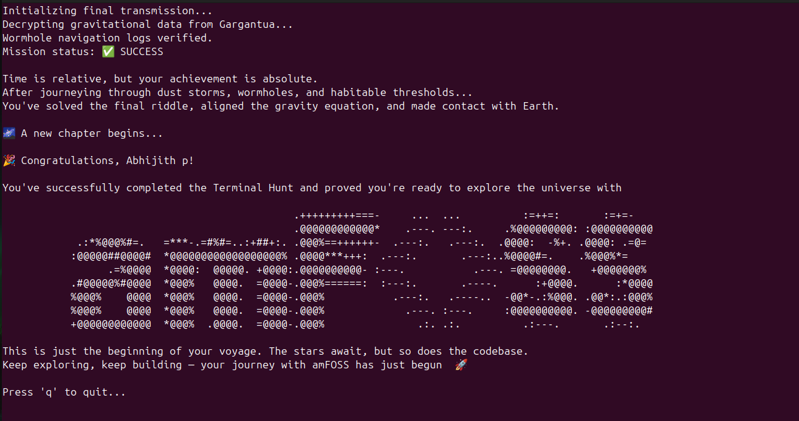

# Task-01 (Terminal Hunt)
## STEP-I (Finding The File inside Facility)
$ I used the command, find -name ".*"  to find the location of the files which were hidden.

$ The file gravity equation had the address Earth/Russia/Vladimir_Oblast/.facility/gravity_equation.txt.

$ Used the command, (cd Earth/Russia/Vladimir_Oblast/.facility) and then (cat gravity_equation.txt) to view it.

You’ve uncovered the first piece of the puzzle — well done, explorer.

The string: T25lIGxhc3QgdGFzaywgYW5kIHlvdSdsbCBoYXZlIHN1Y2Nlc3NmdWxseSBjb21

Its meaning holds power... and danger.
Now that the facility has fulfilled its purpose, it's time to cover your tracks, erase it.
Wipe it from existence so no one — and nothing — can trace your path.
The future depends on secrecy.

## STEP-II (Access The Wormhole Node)
$ Used the command (cd Saturn/Ring), then (ls -la) or find -name ".*" to view hidden files

$ Found out the hidden (.wormhole.sh)

$ Ran (chmod +x .wormhole.sh) to make it executable

$ Executed the file by using the command (./.wormhole.sh)

Well done, traveller
You've managed to breach the distortions near Saturn's ring and accessed the wormhole node
This is your second key wbGV0ZWQgdGhlIFRlcm1pbmFsIEh1bnQhIFJ1biBncmF2aXR5
But now, your mission isn't just to discover... it's to protect
Back up the solutions.md to the safest place you know
And what could be safer than your Home Sweet Home
Copy it to the directory that shares the name of your state and also take a screenshot of this output

## STEP-III (Finding the compatible planet that is habitable for humans)
$ Used (grep -ri "can") to scan for files that contains details of the habitable planet.

$ Used (git checkout GargantuaSystem ) to change the branch from Solar_System to GargantuaSystem.

$ The needed details of the planet had the address Edmunds_Planet/Desert5/.hidden_cave/.hidden_branch/.HABITABLE.txt 

Congrats! You have found the one and only planet humans can thrive in. Here's its genetic code:
LnNoIHVzaW5nIHRoZSBwYXNzd29yZCBPcGVuU291cmNlLCBhbmQgYWRkIGEgc2NyZWVuc2hvdCB0byBzb2x1dGlvbi5tZA==

## STEP-IV (Finding the hidden message )
$ Used (grep -ri "message") to find the file containing the hidden message.

$ Its address: Gargantua/.the_core/.message_from_Them.txt

Congrats on making it this far. Now here's the message that They sent us. Figure out Their language to get the final piece of
the puzzle

01011010 01010011 01110111 01100111 01011001 01010111 00110101 01101011 01001001 01000111 01000110 01101011 01011010 01000011 01000010 01101000 01001001 01001000 01001110 01101010 01100011 01101101 01010110 01101100 01100010 01101110 01001110 01101111 01100010 00110011 01010001 01100111 01100100 01000111 00111000 01100111 01100011 00110010 00111001 01110011 01100100 01011000 01010010 01110000 01100010 01001101 00110001 01111010 01001100 01101101 00110001 01101011

## STEP-V (Decoding and Finishing the Task)
$ Created a bash file "solve.sh" that changes a base-64 code to an ASCII string.

$ Used the bash file to decode all the secret codes and included the paragraph in the file "solutions.md".

$ Used (find . -type d -name ".*") to see all the hidden directories in the branch "GargantuaSystem"

$ Gargantua/the_centre/.the_singularity had the bash file "gravity_singularity.sh"

$ Made it executable using (chmod +x gravity_singularity.sh ) and executed it using (./gravity_singularity.sh ) to get the
final Task completion screen.

#### The name of the file was gravity_singularity.sh instead of gravity.sh and no password was asked while opening that file.

<<<<<<< HEAD
=======

